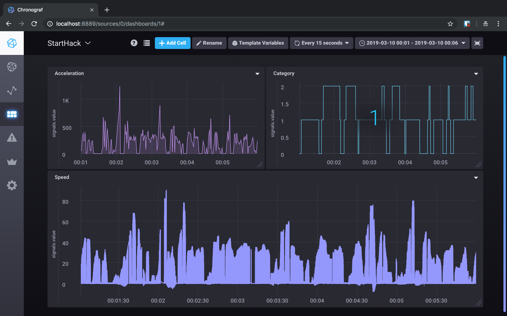

# START hack 2019 - Bosh IoT challenge - Team Balmer Effect

This is the code developed for the Bosh IoT challenge. 
We were provided with loads of data generated by a car,
our main objective was to gather all those data and try to use 
it in order to achieve an objective risk profile of the driver.

https://live.starthack.ch/case-descriptions/

